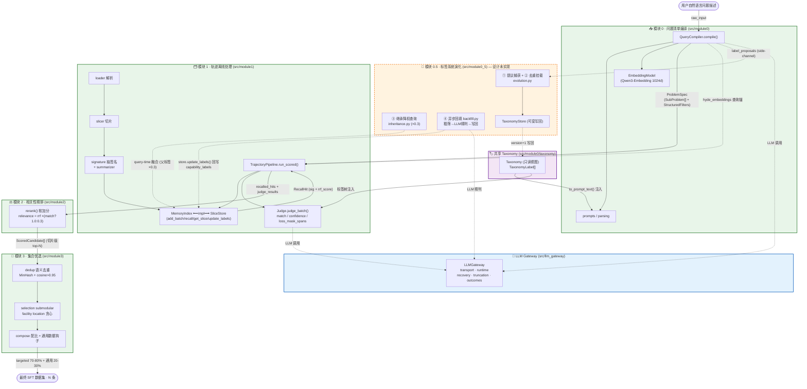

# SWE 轨迹优选器 — 架构 UML

> 视图：模块划分 + 模块间数据传递 + 依赖关系。
> 状态标注：实线框 = 已实现（模块 0/1/2/3 + LLM Gateway）；虚线框 = 仅设计未实现（模块 0.5）。
> 数据流方向：Problem Spec → 召回打分 → 精排 → 集合优选 → SFT 数据集。

## 1. 组件 + 数据流视图（主图）



## 2. 关键数据模型（跨模块契约对象）

```mermaid
classDiagram
    class ProblemSpec {
        +raw_input: str
        +domain: str
        +sub_problems: SubProblem[]
    }
    class SubProblem {
        +id, origin, parent_id
        +target_capability: str[]
        +trajectory_signal: str
        +hyde_positive: str[]
        +keywords: str[]
        +structured_filters
        +confidence, route
    }
    class StructuredFilters {
        +languages, tools_used
        +min_turns
        +has_verification_step
    }
    class TrajectorySignature {
        +trajectory_id, slice_index
        +languages, tools_used
        +turn_count, has_verification_step
        +embedding: float[1024]
        +capability_labels: str[] | None
    }
    class RecallHit {
        +signature: TrajectorySignature
        +rrf_score: float
    }
    class JudgeResult {
        +match: bool
        +confidence: float
        +loss_mask_spans
    }
    class ScoredCandidate {
        +trajectory_id, slice_index
        +sub_problem_id, capability
        +relevance_score
        +judge_confidence, judge_match
        +embedding
    }
    class TaxonomyLabel {
        +label, parent, new_root
        +description
        +description_embedding: float[1024]
    }
    class LabelProposal {
        +label, description, parent
        +description_embedding
        (模块0.5 输入 · 未实现)
    }

    ProblemSpec "1" *-- "N" SubProblem
    SubProblem *-- StructuredFilters
    RecallHit --> TrajectorySignature
    ScoredCandidate ..> RecallHit : rrf_score
    ScoredCandidate ..> JudgeResult : match/conf/spans
    TaxonomyLabel <.. LabelProposal : 去重挂载后入库
    SubProblem ..> TaxonomyLabel : target_capability 引用
    TrajectorySignature ..> TaxonomyLabel : capability_labels 引用
```

## 3. 依赖与调用关系速览

| 依赖方 | 被依赖 | 传递物 / 说明 |
|--------|--------|---------------|
| 模块 0 → 模块 1 | `ProblemSpec` + `hyde_embeddings` | 查询输入（契约唯一耦合点） |
| 模块 0 ⇢ 模块 0.5 | `label_proposals` (side-channel) | 新标签提议（0.5 ② 消费）*未实现* |
| 模块 1 内部 | `MemoryIndex.recall()` → `RecallHit` | 带回 RRF 融合分（关键改动） |
| 模块 1 → 模块 2 | `recalled_hits` + `judge_results` | `rerank()` 软加分 |
| 模块 2 → 模块 3 | `ScoredCandidate[]`（切片级 top-N） | 去重 → submodular → 配比 |
| 模块 0.5 ⇢ 模块 1 | `SliceStore.update_labels()` | 异步回填写回 `capability_labels` *未实现* |
| 模块 0 / 1 / 0.5 → Gateway | LLM 调用 | `QueryCompiler` / `Judge` / `backfill` |
| 模块 0 / 1 / 0.5 → Taxonomy | 读注入 / 可变写回 | 单一事实源，0.5 经 `TaxonomyStore` 演化 |
```
